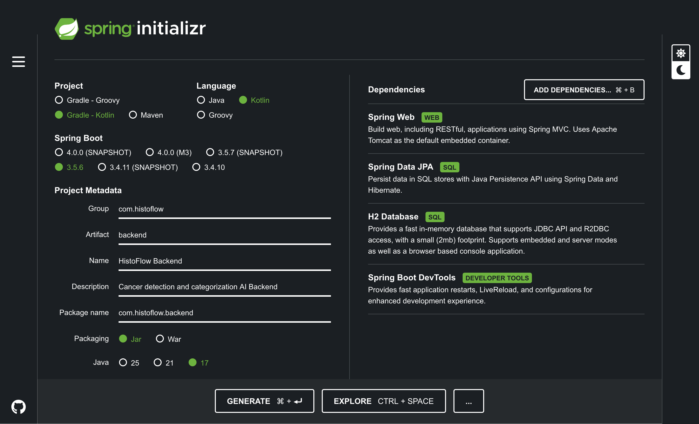

# HistoFlow

Cancer detection AI platform, inspired by Lunit.

## Setup

### Backend

Kotlin + Spring Boot

#### 1. Install SDKMAN and Java

```bash
# install SDKMAN
curl -s "https://get.sdkman.io" | bash

# Source the SDKMAN initialization script
source "$HOME/.sdkman/bin/sdkman-init.sh"

# verify installation
sdk version

# list available Java versions
sdk list java

# Install OpenJDK 17 (Temurin distribution)
sdk install java 17.0.12-tem

# set as default version
sdk default java 17.0.12-tem

# verify installation
java -version
```

#### 2. Intellij Community Edition Setup

Scroll down to the bottom of the [Intellij Community Edition](https://www.jetbrains.com/idea/download/?section=mac) download page, and download and install intellij from JetBrains.

#### 3. Kotlin + Spring Boot Project Setup

Since the community edition does not allow for starting a new Spring Boot project, we'll have to use [https://start.spring.io/](https://start.spring.io/) to initialize the project and open it in the Intellij.



Then, you can open the backend directory in Intellij Community. Get in your Intellij, and open the `backend` directory.

#### 4. (Optional) Install Kotlin Compiler for Commandline use

In case we need Kotlin for commandline use later.

```bash
# sdk install
sdk install kotlin

# or, can use brew
brew install kotlin
```
