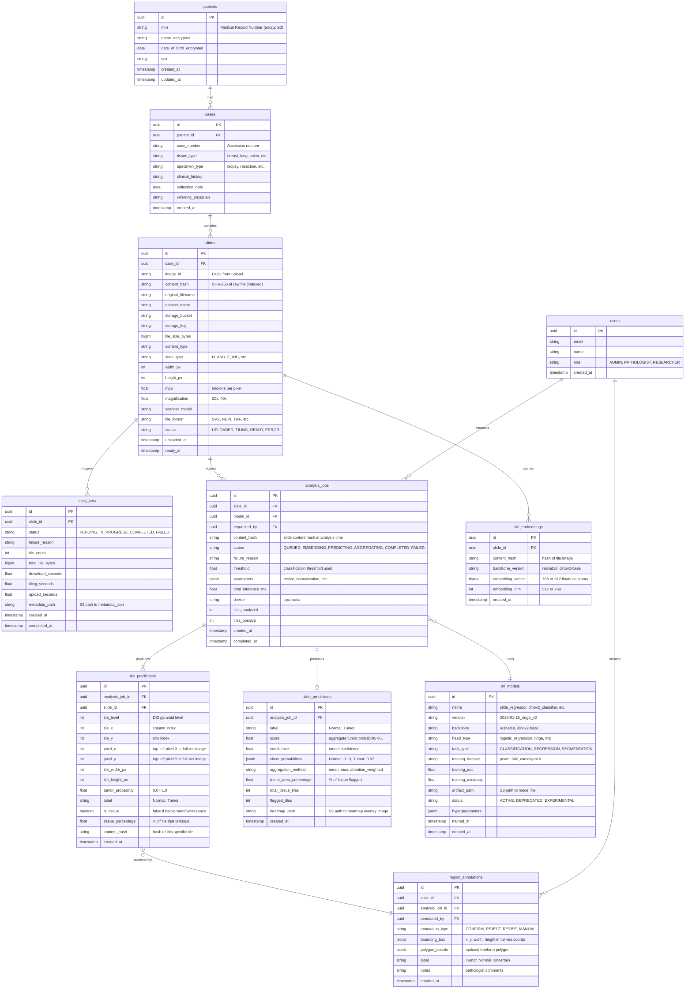

# Database Schema, Result Caching & Region-Level Cancer Detection

> Last Updated: 2026-02-21

This document covers three interconnected design areas:

1. **Image hashing & result caching** — avoid redundant inference
2. **Production-grade database schema** — comprehensive data model for a cancer detection platform
3. **Region-level detection ("red-boxing")** — how to go from "cancer or not" to "**this area** has X% chance"

---

## Part 1: Image Hashing & Result Caching

### The Problem

Currently, every inference request re-runs the full pipeline (download → embed → predict). If the same slide or tile has already been analyzed with the same model, the result should come from the database instantly.

### Hashing Strategy

We need a **content hash** that uniquely identifies an image regardless of filename, upload time, or storage location.

| Approach | How | Pros | Cons |
|----------|-----|------|------|
| **SHA-256 of raw bytes** | `hashlib.sha256(file_bytes).hexdigest()` | Deterministic, collision-resistant, fast | Must read entire file (can be slow for 2GB WSIs) |
| **SHA-256 of S3 ETag** | MinIO already computes an ETag on upload | Free (no extra I/O) | ETag for multipart uploads is NOT a simple hash — it's `md5(part_md5s)-partcount` |
| **Perceptual hash (pHash)** | Hash of the visual content (DCT-based) | Catches re-encoded duplicates | Slower, less precise for medical imaging |
| **SHA-256 streaming** | Hash the file in chunks during upload | No extra read pass needed | Requires integration into the upload pipeline |

**Recommended:** **SHA-256 streaming hash computed during upload completion.**

When the backend calls `completeMultipartUpload`, it also reads the object from MinIO (streaming) and computes SHA-256. This hash is stored in the `slides` table and indexed for fast lookups.

```kotlin
// In UploadService or a new HashService
fun computeContentHash(bucket: String, key: String): String {
    val digest = MessageDigest.getInstance("SHA-256")
    s3Client.getObject(GetObjectRequest.builder().bucket(bucket).key(key).build()).use { stream ->
        val buffer = ByteArray(8192)
        var bytesRead: Int
        while (stream.read(buffer).also { bytesRead = it } != -1) {
            digest.update(buffer, 0, bytesRead)
        }
    }
    return digest.digest().joinToString("") { "%02x".format(it) }
}
```

### Cache Lookup Flow

```
1. Upload completes
2. Backend computes SHA-256 of the uploaded file
3. Backend checks: SELECT * FROM analysis_results WHERE content_hash = ? AND model_version = ?
4. If found → return cached result immediately (skip inference)
5. If not found → trigger inference pipeline, store result with content_hash
```

This means:
- Re-uploading the **same file** under a different name → cache hit
- Same file analyzed with a **different model version** → cache miss (correct — new model may give different results)
- Same file analyzed with the **same model + same threshold** → cache hit

### Embedding Cache (Optional, High Value)

The most expensive step is usually the **feature extraction** (DINOv2/ResNet forward pass). Embeddings can be cached separately since they're model-specific but threshold-independent:

```sql
-- A tile/patch that was embedded once doesn't need to be re-embedded
SELECT embedding_vector FROM tile_embeddings
WHERE content_hash = ? AND backbone_version = ?;
```

This is especially valuable for the red-boxing feature (Part 3), where thousands of tiles per slide need embedding.

---

## Part 2: Production Database Schema

### Entity Relationship Diagram



### Key Design Decisions

| Decision | Rationale |
|----------|-----------|
| **`content_hash` on `slides`** | Enables deduplication and result caching |
| **`content_hash` on `tile_predictions`** | Per-tile caching for region detection |
| **`ml_models` table** | Version tracking — results from model v1 vs v2 are distinct |
| **`analysis_jobs` links slide + model + params** | A specific analysis is the combination of image + model + parameters |
| **`tile_predictions` stores grid coordinates** | Enables heatmap reconstruction: `(tile_x, tile_y) → color(tumor_probability)` |
| **`region_annotations`** | Pathologist feedback loop for model improvement |
| **`patients`/`cases` with encryption** | HIPAA/medical compliance; fields encrypted at rest |
| **`slide_predictions` has `heatmap_path`** | Pre-rendered heatmap stored in S3 for fast frontend loading |

### Indexes

```sql
-- Critical for cache lookups
CREATE INDEX idx_slides_content_hash ON slides(content_hash);
CREATE INDEX idx_analysis_jobs_hash_model ON analysis_jobs(content_hash, model_id);
CREATE INDEX idx_tile_embeddings_hash_backbone ON tile_embeddings(content_hash, backbone_version);

-- Critical for heatmap queries
CREATE INDEX idx_tile_predictions_job_level ON tile_predictions(analysis_job_id, tile_level);
CREATE INDEX idx_tile_predictions_slide_coords ON tile_predictions(slide_id, tile_level, tile_x, tile_y);

-- Operational
CREATE INDEX idx_analysis_jobs_status ON analysis_jobs(status);
CREATE INDEX idx_tiling_jobs_status ON tiling_jobs(status);
```

---

## Part 3: Region-Level Detection ("Red Boxing")

### What We Want

Instead of:
> "This slide has an 87% chance of being cancer"

We want:
> "**This 256×256 region at position (12, 8) at zoom level 15** has a 94% chance of being tumor. The highlighted areas below are the top suspicious regions."

The diagnostician sees a **heatmap overlay** on the slide where hot regions (red/orange) indicate high tumor probability and cold regions (blue/green) indicate normal tissue.

### How It Works: Tile-Level Inference

The key insight is: **you already have tiles**. The tiling service generates DZI tiles at multiple zoom levels. Each tile is a 256×256 JPEG. We can run the classifier on **every individual tile** and store the per-tile probability.

```
Full slide (e.g., 100,000 × 80,000 px)
    ↓ DZI tiling (already done)
Tiles at level 15: ~390 × 312 = ~121,000 tiles (256×256 each)
    ↓ For each tile:
    ↓   1. Is it tissue? (tissue detection filter)
    ↓   2. If yes → extract embedding → predict tumor probability
    ↓   3. Store: (tile_x, tile_y, level, tumor_prob)
    ↓
Heatmap: a 2D grid of probabilities mapped to colors
```

### Step-by-Step Pipeline

#### Step 1: Tissue Detection (Filter Background)

Most of a histopathology slide is **white background** (glass). Running inference on white tiles wastes compute and skews results. A simple filter removes them:

```python
def is_tissue(tile_image: Image.Image, threshold: float = 0.15) -> tuple[bool, float]:
    """
    Check if a tile contains actual tissue vs. background.
    Uses saturation channel in HSV — tissue is colorful, background is white/gray.
    """
    import numpy as np
    hsv = np.array(tile_image.convert("HSV"))
    saturation = hsv[:, :, 1]  # saturation channel
    tissue_ratio = np.mean(saturation > 30) / 255.0  # % of pixels with color
    return tissue_ratio > threshold, float(tissue_ratio)
```

Typically **60-80% of tiles are background** and can be skipped, saving massive compute.

#### Step 2: Feature Extraction (Per Tile)

For each tissue tile, extract the embedding vector. This is identical to what `sk-regression` and `justin-regression` already do, but applied to every tile:

```python
# Using existing DinoV2Embedder
embedder = DinoV2Embedder()  # loads facebook/dinov2-base

for tile in tissue_tiles:
    # Check embedding cache first
    cached = db.query("SELECT embedding_vector FROM tile_embeddings WHERE content_hash = ? AND backbone = ?",
                      tile.hash, "dinov2-base")
    if cached:
        embedding = cached.embedding_vector
    else:
        embedding = embedder.embed_image(tile.image)  # shape: (768,)
        db.insert_embedding(tile.hash, "dinov2-base", embedding)
```

#### Step 3: Classification (Per Tile)

Apply the trained classifier head to each embedding:

```python
clf = joblib.load("models/dinov2_classifier.pkl")  # LogisticRegression

for tile, embedding in zip(tissue_tiles, embeddings):
    probs = clf.predict_proba(embedding.reshape(1, -1))[0]
    tumor_prob = float(probs[1])
    label = "Tumor" if tumor_prob >= threshold else "Normal"

    # Store in database
    db.insert_tile_prediction(
        analysis_job_id=job.id,
        slide_id=slide.id,
        tile_x=tile.x, tile_y=tile.y,
        tile_level=tile.level,
        pixel_x=tile.x * 256,  # convert grid → pixel coords
        pixel_y=tile.y * 256,
        tumor_probability=tumor_prob,
        label=label,
        is_tissue=True,
        tissue_percentage=tile.tissue_ratio
    )
```

#### Step 4: Aggregation (Slide-Level Summary)

Aggregate per-tile predictions into a slide-level summary:

```python
tile_probs = [t.tumor_probability for t in tile_predictions if t.is_tissue]

slide_prediction = SlidePrediction(
    score=np.mean(tile_probs),                    # mean tumor probability
    tumor_area_percentage=np.mean([p > threshold for p in tile_probs]) * 100,
    total_tissue_tiles=len(tile_probs),
    flagged_tiles=sum(1 for p in tile_probs if p > threshold),
    aggregation_method="mean",                     # can also use max, attention-weighted
    confidence=1.0 - np.std(tile_probs),           # higher std = less confident
)
```

#### Step 5: Heatmap Generation

Convert the 2D grid of probabilities into a color-mapped overlay image:

```python
import numpy as np
from PIL import Image
import matplotlib.cm as cm

def generate_heatmap(tile_predictions, grid_width, grid_height, colormap="RdYlGn_r"):
    """
    Generate a heatmap overlay image from tile predictions.
    Red = high tumor probability, Green = low.
    """
    # Create probability grid (initialize to -1 for non-tissue)
    grid = np.full((grid_height, grid_width), -1.0)

    for pred in tile_predictions:
        if pred.is_tissue:
            grid[pred.tile_y, pred.tile_x] = pred.tumor_probability

    # Apply colormap (transparent for non-tissue areas)
    cmap = cm.get_cmap(colormap)
    rgba = np.zeros((grid_height, grid_width, 4), dtype=np.uint8)

    for y in range(grid_height):
        for x in range(grid_width):
            if grid[y, x] >= 0:
                color = cmap(grid[y, x])  # returns (R, G, B, A) in [0, 1]
                rgba[y, x] = [int(c * 255) for c in color[:3]] + [180]  # semi-transparent
            # else: stays transparent (0, 0, 0, 0)

    # Scale up to match tile dimensions (each cell = 256px)
    heatmap = Image.fromarray(rgba, 'RGBA')
    heatmap = heatmap.resize((grid_width * 256, grid_height * 256), Image.NEAREST)

    return heatmap
```

#### Step 6: Frontend Overlay

OpenSeadragon supports **multi-layer rendering**. The heatmap is served as a separate tile source overlaid on the original slide:

```typescript
// In ImageViewer.tsx
const viewer = OpenSeadragon({ ... });

// Add the original slide
viewer.addTiledImage({
    tileSource: `${API_URL}/api/v1/tiles/${imageId}/image.dzi`,
});

// Add the heatmap overlay (semi-transparent)
viewer.addTiledImage({
    tileSource: `${API_URL}/api/v1/analysis/${analysisId}/heatmap.dzi`,
    opacity: 0.5,           // user-adjustable slider
    compositeOperation: 'source-over',
});

// OR: use a simple image overlay for lower zoom levels
viewer.addOverlay({
    element: heatmapImageElement,
    location: new OpenSeadragon.Rect(0, 0, 1, 1),
});
```

### Performance Considerations

| Concern | Solution |
|---------|----------|
| **121K tiles per slide** | Skip background tiles (~70% reduction); batch embeddings (GPU: 32-64 at a time) |
| **Embedding time** | DINOv2 on GPU: ~5ms/tile → ~35 sec for 7K tissue tiles; on CPU: ~50ms/tile → ~6 min |
| **Re-analysis** | Embedding cache (`tile_embeddings` table) — only the classifier head is re-run |
| **Heatmap storage** | Store as pre-rendered DZI tiles in S3, or store the probability grid and render on-the-fly |
| **Real-time progress** | WebSocket updates: `{tiles_processed: 2100, total_tissue_tiles: 7200}` |

### Choosing the Right Zoom Level

You don't need to analyze at the **highest** zoom level. The level depends on the clinical question:

| Level | Tile Size (at full res) | Use Case |
|-------|----------------------|----------|
| Highest (e.g., 17) | 256×256 px (~64µm) | Cell-level detection, mitosis counting |
| Mid (e.g., 14-15) | ~1K-2K px | **Tumor region detection** ← recommended starting point |
| Low (e.g., 10-12) | ~8K-16K px | Quick tissue overview, macro-scale patterns |

**Recommendation:** Start at the level where each tile covers a visible tissue region (roughly 512µm–1mm across). This balances spatial precision with compute.

### Red-Boxing API Response

When the frontend loads an analyzed slide, it fetches the tile-level predictions to draw bounding boxes:

```json
// GET /api/v1/analysis/{analysisId}/tile-predictions?level=15&min_probability=0.7
{
  "analysisId": "uuid",
  "slideId": "uuid",
  "model": { "name": "dinov2_classifier", "version": "2026-02-15" },
  "threshold": 0.5,
  "level": 15,
  "tilePredictions": [
    {
      "tileX": 12, "tileY": 8,
      "pixelX": 3072, "pixelY": 2048,
      "width": 256, "height": 256,
      "tumorProbability": 0.94,
      "label": "Tumor",
      "isTissue": true
    },
    {
      "tileX": 13, "tileY": 8,
      "pixelX": 3328, "pixelY": 2048,
      "width": 256, "height": 256,
      "tumorProbability": 0.87,
      "label": "Tumor",
      "isTissue": true
    }
  ],
  "summary": {
    "totalTissueTiles": 7234,
    "flaggedTiles": 423,
    "tumorAreaPercentage": 5.8,
    "aggregateScore": 0.31,
    "aggregationMethod": "mean"
  }
}
```

The frontend draws red bounding boxes (with opacity proportional to probability) on the OpenSeadragon viewer:

```typescript
tilePredictions
    .filter(t => t.tumorProbability >= selectedThreshold)
    .forEach(tile => {
        const rect = viewer.viewport.imageToViewportRectangle(
            tile.pixelX, tile.pixelY, tile.width, tile.height
        );
        const overlay = document.createElement('div');
        overlay.className = 'tumor-overlay';
        overlay.style.border = `2px solid rgba(255, 0, 0, ${tile.tumorProbability})`;
        overlay.style.backgroundColor = `rgba(255, 0, 0, ${tile.tumorProbability * 0.3})`;
        overlay.title = `${(tile.tumorProbability * 100).toFixed(1)}% tumor probability`;
        viewer.addOverlay({ element: overlay, location: rect });
    });
```

---

## Implementation Phases

| Phase | Description | Prerequisite |
|-------|-------------|-------------|
| **Phase 1** | Add `slides`, `ml_models`, `analysis_jobs`, `slide_predictions` tables. Wire up SHA-256 hashing during upload. Cache slide-level results. | DB migration |
| **Phase 2** | Add `tile_predictions` table. Implement tile-level inference loop (tissue filter → embed → classify). Store per-tile probabilities. | ML service HTTP/queue API |
| **Phase 3** | Add `tile_embeddings` cache. Batch embedding with GPU. Massive speedup on re-analysis. | Phase 2 |
| **Phase 4** | Heatmap generation + DZI overlay serving. Frontend overlay with opacity slider. | Phase 2 |
| **Phase 5** | Add `region_annotations` table. Pathologist review UI (confirm/reject/revise predictions). Feedback loop for model retraining. | Phase 4 |
| **Phase 6** | `patients`/`cases` tables. HIPAA-compliant data model with encryption at rest. | Compliance review |

---

## Relation to Existing ADRs

This design extends ADR-006's migration path:

| ADR-006 Phase | This Document |
|---------------|---------------|
| Phase 1: Regression on downscaled images | Already implemented in `sk-regression` |
| Phase 2: Patch extraction + aggregation → heatmaps | **Part 3 of this doc** (tile-level inference) |
| Phase 3: MIL for WSI-level labels | Future — attention-weighted aggregation in `slide_predictions` |
| Phase 4: Segmentation for pixel-level outputs | Future — would replace tile grid with pixel masks |
